<div align="center">
  
</div>

<div align="center">
  <a href="https://www.linkedin.com/in/gabriel-bacelar-964b03278">
    
  </a>
  <a href="mailto:gbacelar099@gmail.com">
    
  </a>
  <a href="https://github.com/GabrielBacelarS">
    
  </a>
</div>

<br>

## 🎯 Sobre Mim

```typescript
const gabrielBacelar = {
  role: "Tech Leader & Full Stack Developer",
  location: "Brasil 🇧🇷",
  current: "Liderando projetos de SaaS e automações",
  expertise: [
    "Arquitetura de SaaS Multi-tenant",
    "Integrações e APIs RESTful",
    "Automação de Processos com n8n",
    "Liderança Técnica de Equipes"
  ],
  learning: ["RAG com IA", "Supabase", "Arquiteturas Serverless"]
};
```

## 📊 GitHub Analytics

<div align="center">
  <!-- Opção 1: URLs alternativas -->
  
  
</div>

<div align="center">
  
</div>

<!-- Se ainda não funcionar, use estas alternativas: -->
<!-- 
<div align="center">
  
  
</div>
-->

## 🛠️ Tech Stack

### 💻 Linguagens & Frameworks
<div align="center">
  
  
  
  
  
  
</div>

### 🗄️ Banco de Dados & Cloud
<div align="center">
  
  
  
  
  
  
</div>

### 🔧 Ferramentas & Automação
<div align="center">
  
  
  
  
  
  
</div>

## 🚀 Projetos em Destaque

<div align="center">
  
### 💬 **Chatwoot Integration Suite**
> Plataforma open source de atendimento omnichannel com integrações customizadas

<div>
  
  
</div>

**Features:** WhatsApp Business API | Instagram Direct | Facebook Messenger | Telegram | Email | Live Chat  
**Impacto:** 10k+ mensagens/dia processadas | 99.9% uptime

---

### 📊 **Closefy CRM**
> Ferramenta completa de gestão comercial e relacionamento com cliente

<div>
  
  
</div>

**Features:** Pipeline de Vendas | Automação de Follow-ups | Dashboard Analytics | Integração Multi-canal  
**Impacto:** 50+ empresas atendidas | R$ 2M+ em vendas gerenciadas

---

### 🤖 **Automação Inteligente n8n**
> Workflows customizados para automação de processos empresariais

<div>
  
  
</div>

**Integrações:** Fiscal (NF-e) | WhatsApp Business | CRMs | ERPs | Redes Sociais  
**Impacto:** 500+ horas/mês economizadas | 30+ processos automatizados

</div>

## 📈 Métricas & Conquistas

<div align="center">
  <table>
    <tr>
      <td align="center">
        
        <br><strong>25+</strong>
      </td>
      <td align="center">
        
        <br><strong>15+ Devs</strong>
      </td>
      <td align="center">
        
        <br><strong>99.9%</strong>
      </td>
      <td align="center">
        
        <br><strong>100+</strong>
      </td>
    </tr>
  </table>
</div>

## 🎓 Competências Core

```mermaid
graph LR
    A[Gabriel Bacelar] --> B[Liderança Técnica]
    A --> C[Arquitetura de Software]
    A --> D[DevOps & Cloud]
    A --> E[Automação]
    
    B --> B1[Gestão de Equipes]
    B --> B2[Code Review]
    B --> B3[Mentoring]
    
    C --> C1[Microserviços]
    C --> C2[Clean Architecture]
    C --> C3[Design Patterns]
    
    D --> D1[CI/CD]
    D --> D2[Docker/K8s]
    D --> D3[AWS]
    
    E --> E1[n8n Workflows]
    E --> E2[API Integration]
    E --> E3[Process Optimization]
```



## 🌱 Atualmente Estudando

<div align="center">
  
| Tecnologia | Progresso | Objetivo |
|------------|-----------|----------|
| **RAG & IA Generativa** | 🟡🟡🟡⚪⚪ | Implementar busca semântica em documentos |
| **Supabase** | 🟡🟡🟡🟡⚪ | Migrar arquitetura para Serverless |
| **Rust** | 🟡🟡⚪⚪⚪ | Performance crítica em microserviços |
| **Web3** | 🟡⚪⚪⚪⚪ | Smart Contracts e DApps |

</div>

## 📫 Vamos Conversar!

<div align="center">
  
Estou sempre aberto a discutir novos projetos, ideias criativas ou oportunidades de parceria.

<a href="mailto:gbacelar099@gmail.com">
  
</a>

<a href="https://www.linkedin.com/in/gabriel-bacelar-964b03278">
  
</a>

</div>

---

<div align="center">
  
  
  ### 💭 "Transformando ideias em produtos digitais que geram impacto real"
  
  ⭐ **Se você gostou do meu trabalho, considere dar uma estrela nos repositórios!**
</div>

<div align="center">
  
</div>
